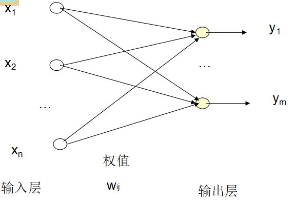

# 智能计算

**美国科学家贝慈德克（J.C.Bezdek）从计算智能系统角度所给出的定义:**

> 如果一个系统仅处理低层的数值数据，含有模式识别部件，没有使用人工智能意义上的知识，且具有计算适应性、计算容错力、接近人的计算速度和近似于人的误差率这4个特性，则它是计算智能的。

计算智能涉及神经网络、模糊逻辑、进化计算、免疫计算、DNA计算和人工生命等领域，它的研究和发展正反映了当代科学技术多学科交叉与集成的重要发展趋势。

## 三种方法

神经网络是一种对人类智能的结构模拟方法，它是通过对大量人工神经元的广泛并行互联，构造人工神经网络系统去模拟生物神经系统的智能机理的。

进化计算是一种对人类智能的演化模拟方法，它是通过对生物遗传和演化过程的认识，用进化算法去模拟人类智能的进化规律的。

模糊计算是一种对人类智能的逻辑模拟方法，它是通过对人类处理模糊现象的认知能力的认识，用模糊逻辑去模拟人类的智能行为的。

## 神经网络

心理学家麦克洛奇(W.McM  ulloch)和数理逻辑学家皮茨(W.Pitts)根据生物神经元的功能和结构，提出了一个将神经元看作二进制阈值元件的简单模型，即MP模型。

人工神经元是一个具有多输入，单输出的非线性器件。

- wij：权值
- bias：阈值
- xi：输入
- f：激励函数（传递函数）

### 常用传递函数

1. 阈值型 1 if x>0 else 0
2. 斜坡函数 x if -1 < x <1;1 if x > 1;-1 if x < -1
3. S型 1/(1+e^(-ax))
4. 双曲正切 (1-e^(-ax))/(1+e^(-ax))

### 神经元
#### 网络拓扑结构

- 前馈
- 反馈

#### 学习能力

- 一个修改权值和阈值的过程
- 目标是为了使网络经过训练后可以完成某项任务
- 三种学习方式
    - 有师学习算法：能够根据期望的和实际的网络输出（对应于给定输入）间的差来调整神经元间连接的强度或权。
    - 无师学习算法：不需要知道期望输出。
    - 强化学习算法：采用一个“评论员”来评价与给定输入相对应的神经网络输出的优度（质量因数）。强化学习算法的一个例子是遗传算法（GA）。

### 网络模型

传统的感知机模型

- 具有误差反向传播功能的反向传播网络模型
- 采用多变量插值的径向基函数网络模型
- 建立在统计学习理论基础上的支撑向量机网络模型
- 采用反馈联接方式的反馈网络模型
- 基于模拟退火算法的随机网络模型

### 感知器模型（Perceptron）

- 美国学者罗森勃拉特（Rosenblatt）于1957年为研究大脑的存储、学习和认知过程而提出
- 具有自学习能力
- 拓扑结构是分层前向网络
    - 单层感知器
    - 多层感知器

#### 线性阈值单元TLU

当输入信息的加权和大于或等于阈值时，输出为1,否则输出0或-1

### 单层感知器

多个线性阈值单元纵向排列

输入向量与权值矩阵相乘得输出矩阵

### 多层感知器
多层感知器是通过在单层感知器的输入、输出层之间加入一层或多层处理单元所构成的。
多层感知器的输入与输出之间是一种高度非线性的映射关系，若采用有n个输入，m个输出的多层感知器模型，则该网络就是一个从n维欧氏空间到m维欧氏空间的非线性映射。
多层感知器可以实现非线性可分问题的分类。

### 机器学习

**公式**

Wji = Wji + η(Tj-Oj)Oi

1. Wji ：i向j的权值
2. η：学习常数
3. Oj：j的输出
4. Oi：i的输出，j的输入

## BP网络

误差反向传播(Error Back Propagation)网络——BP(Back Propagation)网络

由美国加州大学的鲁梅尔哈特和麦克莱兰在研究并行分布式信息处理方法，探索人类认知微结构的过程中，于1985年提出的一种网络模型。

BP网络的网络拓扑结构是多层前向网络

BP网络中，同层节点之间不存在相互连接，层与层之间多采用全互连方式，且各层的连接权值可调

BP网络实现了明斯基的多层网络的设想，是当今神经网络模型中使用最广泛的一种

**BP算法的学习过程**由正向和反向传播组成。输入信息从输入层经隐单元传至输出层，如果实际输出与期望输出不一致，则把其误差沿连接路径返回，去修改各层神经元的权值，最后使得误差最小。

## Hopfield 网络模型

**单层全互连网络**，在Hopfidld网络中，虽然神经元**自身无连接**，但由于**每个神经元都与其他神经元相连**，即每个神经元的输出都将通过突触连接权值传递给别的神经元，同时每个神经元又都接受其他神经元传来的信息，这样对每个神经元来说，其输出经过其他神经元后又有可能反馈给自己，因此Hopfidld网络是一种反馈神经网络
